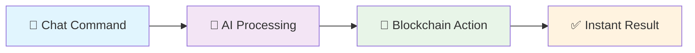

# Astra 🚀
## AI-Powered Blockchain Agent for Hedera Network

> Transform blockchain interactions with simple chat commands. Deploy contracts, send tokens, create NFTs - all with natural language.

[](https://hedera.com)
[](https://ai.google.dev)
[](https://nextjs.org)

---

## ✨ What Makes Astra Special?

| 🤖 **AI-First** | 💰 **One Command** | 🔐 **Secure** |
|:---:|:---:|:---:|
| Chat with your blockchain | Deploy contracts instantly | Military-grade encryption |
| Natural language processing | Create tokens & NFTs | Secure credential system |
| Smart transaction routing | Automated salary payments | Premium subscription model |

## 🎯 Core Features

### 💬 Smart Chat Interface
```
You: "Send 100 HBAR to alice"
Astra: ✅ Sent! Hash: 0xabc123...
```
- Natural language commands
- Voice & text input
- Context-aware processing

### ⚡ One-Command Operations
```
You: "Create CrossDoge token, 1B supply"
Astra: 🚀 Token deployed! Contract: 0xdef456...
```
- Deploy smart contracts instantly
- Create tokens & NFT collections
- Automated transaction processing

### 📅 Payment Scheduling & Automation
```
You: "Schedule $1000 HBAR salary to john_doe monthly"
Astra: ✅ Recurring payment set! Next: Feb 1st
```
- **Salary Automation**: Monthly/weekly employee payments
- **Event-Based Payments**: Birthday, holiday bonuses
- **Recurring Transfers**: Custom schedules (daily, weekly, monthly)
- **Bulk Distributions**: Mass payments to multiple addresses
- **Smart Reminders**: Automated payment notifications

### 🔧 Developer Tools
- **Workflow Visualization**: Interactive Mermaid diagrams
- **Contract Templates**: Pre-built smart contracts
- **Security Scanning**: Automated vulnerability detection
- **Gas Optimization**: Smart fee estimation

### 💎 Premium Features
- **Subscription Tiers**: Basic, Pro, Enterprise
- **Priority Processing**: Faster execution
- **Advanced AI**: Enhanced capabilities
- **API Access**: Extended rate limits

---

## 🏗️ How It Works



1. **Chat**: Send natural language commands
2. **Process**: AI understands and validates
3. **Execute**: Secure blockchain operations
4. **Confirm**: Real-time transaction results

---

## 🛠️ Tech Stack

<table>
<tr>
<td>

**Frontend** 🎨
- Next.js 14 + TypeScript
- RainbowKit + Wagmi
- Tailwind CSS
- Theme switching

</td>
<td>

**Backend** ⚙️
- Python FastAPI
- Google Gemini AI
- MCP Server/Client
- Google Agent Kit SDK

</td>
</tr>
<tr>
<td>

**Blockchain** ⛓️
- Hedera Network
- Solidity contracts
- Web3.py + Ethers.js

</td>
<td>

**Storage** 💾
- MongoDB
- Pinata IPFS
- Coinbase API
- Encrypted credentials

</td>
</tr>
</table>

---

## 🚀 Try It Out!

### Example Commands
```
💰 "Send 50 HBAR to john_doe"
🪙 "Create MoonCoin token with 1M supply"
🖼️ "Deploy CyberPunks NFT collection"
📊 "Show me HBAR price trends"
⚙️ "Generate voting contract workflow"
📅 "Schedule $2000 HBAR salary to alice monthly"
🎉 "Set birthday bonus of 100 HBAR for bob on March 15th"
⏰ "Pay rent of 500 HBAR every 1st of month"
```

---

## 🔐 Security First

- **🛡️ Military-grade encryption** for all credentials
- **🔐 Dual wallet system**: RainbowKit + secure credential storage
- **✅ Transaction verification** before execution
- **📋 Complete audit trails** for all operations

---

## 🏆 Why Choose Astra?

✅ **First AI agent on Hedera** with single-command blockchain operations  
✅ **Unique credential system** for autonomous wallet access  
✅ **Professional UI** with light/dark mode  
✅ **Advanced workflows** with interactive diagrams  
✅ **Secure subscriptions** via RainbowKit  

---

## 📞 Get Support

- 📧 **Email**: tanishqgupta322@gmail.com

---

<div align="center">

**Built with ❤️ for the Hedera Ecosystem**

*Where AI Meets Blockchain Innovation* ✨

</div>