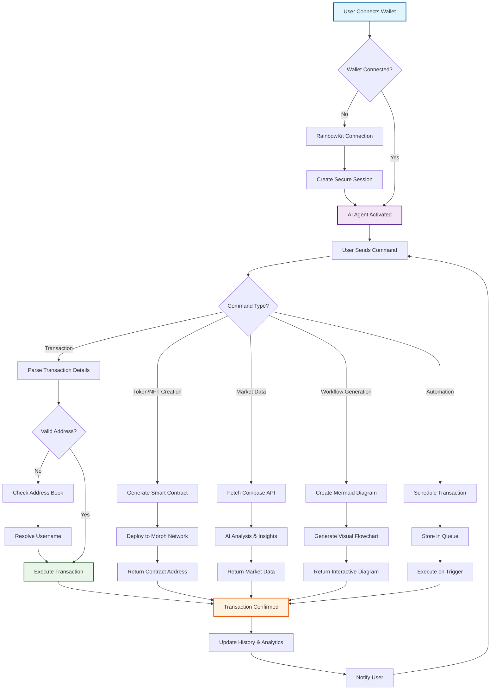

# Astra Morph - AI-Powered Blockchain Transaction Agent 🚀

**The Ultimate AI Agent for Seamless Blockchain Transactions on Morph Network**

Astra Morph is a revolutionary AI-powered agent that transforms how you interact with blockchain transactions. Built specifically for the Morph network, it combines artificial intelligence with blockchain technology to provide an intuitive, secure, and automated transaction experience with professional-grade features.

## Key Features ✨

### AI-Powered Transaction Management
- **Smart Chatbot Interface**: Send MORPH, ETH, and other tokens through natural language commands
- **Intelligent Transaction Processing**: AI understands context and executes transactions seamlessly
- **Single Command Operations**: Deploy contracts, create tokens/NFTs, and transfer funds with one message
- **Voice & Text Commands**: Multiple input methods for maximum convenience
- **Contract Workflow Generation**: AI-powered smart contract visualization and flowchart creation
- **Autonomous Wallet Access**: Secure credential system allows AI agent direct wallet access for instant operations

### Subscription & Premium Features
- **Tiered Subscription System**: Multiple subscription levels with increasing capabilities
- **Premium AI Access**: Advanced AI features for subscribers
- **Priority Transaction Processing**: Faster execution for premium users
- **Extended API Limits**: Higher rate limits and extended functionality
- **Subscription Management**: Easy upgrade/downgrade through RainbowKit wallet integration

### User Experience & Interface
- **Light/Dark Mode Toggle**: Professional theme switching across all components
- **Responsive Design**: Optimized for desktop and mobile devices
- **Intuitive Dashboard**: Clean, modern interface with sidebar navigation
- **Real-time Updates**: Live transaction status and balance monitoring

### Session Management & Security
- **Secure Session Management**: Persistent and encrypted user sessions with automatic timeout
- **Wallet Integration**: RainbowKit connection for subscription payments and premium access
- **Credential System**: Secure wallet credential storage for AI agent access to your wallet
- **Private Key Encryption**: Military-grade encryption for wallet credentials
- **Access Control**: Premium subscription system with secure payment verification
- **Single Command Operations**: Execute transactions, deployments, and creations with simple messages

### Address Book System
- **Username-Based Transactions**: Send tokens using memorable usernames instead of complex addresses
- **Contact Management**: Organize and manage frequent transaction recipients
- **Smart Address Resolution**: Automatic address lookup and verification
- **Bulk Contact Import**: Upload and manage multiple recipient addresses

### Automated Transaction Features
- **Salary Automation**: Set up recurring salary payments in MORPH to employees
- **Event-Based Payments**: Automated birthday, holiday, and special occasion transfers
- **Scheduled Transactions**: Custom recurring payment schedules
- **Bulk Payments**: Mass distribution to multiple addresses

### Market Intelligence & Trading
- **Real-Time Price Data**: Current MORPH and token prices from Coinbase API
- **Market Analysis**: AI-powered trend predictions and market insights
- **Trading Analytics**: Advanced trading data and performance metrics
- **Price Alerts**: Automated notifications for significant price movements

### Token & NFT Management
- **Custom Token Deployment**: Deploy ERC-20 tokens with simple prompts
- **NFT Creation & Minting**: Generate and mint NFTs with AI-powered metadata
- **Memecoin Generator**: Create memecoins with custom tokenomics
- **Asset Portfolio Tracking**: Comprehensive token and NFT portfolio management

### Smart Contract Features
- **Contract Generation**: AI-powered smart contract creation and deployment
- **Workflow Visualization**: Mermaid.js flowcharts for contract interactions
- **Contract Templates**: Pre-built templates for common use cases
- **Security Scanning**: Automated contract vulnerability detection

### Blockchain Integration
- **Multi-Chain Support**: Morph network with EVM compatibility
- **Transaction History**: Complete logs with detailed analytics
- **Block Explorer Integration**: Real-time network and block information
- **Gas Optimization**: Smart gas fee estimation and optimization
### Storage & External Services
- **Pinata IPFS Integration**: Decentralized storage for NFT metadata and digital assets
- **MongoDB Integration**: Secure data persistence and user management
- **Asset Management**: Comprehensive digital asset portfolio tracking
- **Secure Asset Retrieval**: Easy access to all stored NFTs and metadata

### Information & Analytics
- **Latest Crypto News**: Real-time cryptocurrency and blockchain news feeds
- **Market Reports**: Comprehensive analysis and trend reports
- **Token Directory**: Complete token listings and detailed information
- **Network Statistics**: Morph network health and performance metrics

## Architecture & Workflow 🏗️



## Technology Stack 🛠️

### Frontend
- **Next.js 14** - Modern React framework with App Router
- **TypeScript** - Type-safe development environment
- **Tailwind CSS** - Utility-first CSS framework
- **RainbowKit** - Premium wallet connection interface
- **Wagmi** - React hooks for Ethereum interaction
- **next-themes** - Seamless light/dark mode implementation

### Backend & AI
- **Python FastAPI** - High-performance API framework
- **Google Gemini AI** - Advanced AI model for text and image generation
- **Google Agent Kit (SDK)** - AI agent development toolkit and SDK integration
- **Mermaid.js** - Flowchart and diagram generation
- **MCP Server** - Model Context Protocol server implementation
- **MCP Client** - Model Context Protocol client for agent communication

### Blockchain & Web3
- **Solidity** - Smart contract development
- **Morph Network** - Layer 2 scaling solution
- **Web3.py** - Python blockchain interaction library
- **Ethers.js** - JavaScript Ethereum library

### Database & Storage
- **MongoDB** - NoSQL database for user data and sessions
- **Pinata IPFS** - Decentralized storage for NFTs and metadata
- **Coinbase API** - Real-time cryptocurrency market data and pricing
- **Credential Storage** - Encrypted wallet credentials for AI agent access

### Security & Infrastructure
- **JWT Authentication** - Secure session management
- **Encryption Libraries** - Military-grade data protection
- **Rate Limiting** - API security and abuse prevention
- **Subscription Management** - Tiered access control and premium features
- **Credential Security** - Secure storage and access for wallet credentials

## Usage Examples 📖

### Basic Transaction
```
User: "Send 5 MORPH to john_doe"
Agent: ✅ Sent 5 MORPH to john_doe (0x742d35Cc6634C0532925a3b8D404d3aABb8c4532)
Transaction Hash: 0xabc123...
Gas Used: 21,000 | Network: Morph Testnet
```

### Smart Contract Workflow Generation
```
User: "Generate a workflow for my NFT minting contract"
Agent: ✅ Created interactive flowchart showing:
- User connects wallet → Mint NFT → Payment verification → 
- Metadata upload to IPFS → Contract execution → NFT transfer
[Visual Mermaid diagram displayed]
```

### NFT Creation & Deployment
```
User: "Create an NFT collection called CyberPunks with 10,000 supply"
Agent: ✅ NFT Contract deployed successfully!
Contract Address: 0xdef456...
Collection: CyberPunks | Supply: 10,000
Metadata stored on IPFS via Pinata
```

### Automated Salary System
```
User: "Set up monthly salary of 1000 MORPH to all employees"
Agent: ✅ Automated salary payments configured for 25 employees
Next payment: March 1st, 2025
Total monthly cost: 25,000 MORPH
```

### Single Command Token Creation
```
User: "Create a memecoin called MorphDoge with symbol MDOGE, supply 1 billion"
Agent: ✅ Token deployed in one command!
Contract Address: 0xabc789...
Symbol: MDOGE | Supply: 1,000,000,000
Network: Morph Testnet | Gas Used: 892,456
```

### Instant Contract Deployment
```
User: "Deploy a simple voting contract for my DAO"
Agent: ✅ Voting contract deployed successfully!
Contract Address: 0x123def...
Features: Proposal creation, member voting, result tallying
Ready for interaction on Morph Network
```

### Subscription Management
```
User: "Upgrade to premium subscription"
Agent: 💎 Premium Subscription Activated!
Payment: 0.01 ETH via RainbowKit
Benefits: Priority processing, advanced AI, unlimited operations
```

## Security & Privacy 🔐

- **Military-grade Encryption**: AES-256 encryption for all sensitive data
- **Secure Session Management**: JWT tokens with automatic expiration and refresh
- **Dual Wallet System**: 
  - **RainbowKit Integration**: For subscription payments and premium access
  - **Credential System**: Secure storage of wallet credentials for AI agent operations
- **Transaction Verification**: Multi-step verification before execution
- **Audit Trails**: Comprehensive logging for all operations and transactions
- **Smart Contract Security**: Automated vulnerability scanning and best practices
- **Private Key Protection**: Never stored in plain text, always encrypted
- **Subscription Security**: Secure payment processing and access control
- **Single Command Security**: Safe execution of complex operations through simple messages

## Getting Started 🚀

### Prerequisites
- Node.js 18+ and npm/yarn
- Python 3.9+ for backend services and MCP server
- MongoDB instance (local or cloud)
- Morph network wallet with test tokens
- Google Agent Kit SDK setup

### Installation

1. **Clone the repository**
```bash
git clone https://github.com/Spydiecy/Astra_Morph.git
cd Astra_Morph
```

2. **Frontend Setup**
```bash
cd frontend
npm install
cp .env.example .env.local
# Configure your environment variables
npm run dev
```

3. **Backend & MCP Server Setup**
```bash
cd backend
pip install -r requirements.txt
# Install Google Agent Kit SDK
pip install google-agent-kit
python -m uvicorn main:app --reload
```

4. **Environment Configuration**
```bash
# Frontend (.env.local)
NEXT_PUBLIC_GEMINI_KEY=your_gemini_api_key
NEXT_PUBLIC_PINATA_JWT=your_pinata_jwt
NEXT_PUBLIC_COINBASE_API_KEY=your_coinbase_api_key
NEXTAUTH_SECRET=your_auth_secret

# Backend (.env)
MONGODB_URI=your_mongodb_connection
COINBASE_API_KEY=your_coinbase_api_key
ENCRYPTION_KEY=your_encryption_key
GOOGLE_AGENT_KIT_API_KEY=your_agent_kit_key
MCP_SERVER_PORT=3001
```

### Quick Start
1. Launch the MCP server: `python mcp_server.py`
2. Launch the application: `npm run dev`
3. Connect your wallet using RainbowKit for subscription management
4. Set up your wallet credentials for AI agent access (secure credential system)
5. Toggle between light/dark mode as preferred
6. Start interacting with the AI agent with single command operations
7. Explore features like NFT creation, contract workflows, and automated payments
8. Upgrade to premium subscription for advanced features

## Contributing 🤝

This project is licensed under the MIT License - see the [LICENSE](LICENSE) file for details.

## Support & Community 🆘

- **Email**: tanishqgupta322@gmail.com

## Achievements & Recognition 🏆

- **First AI Agent** with automated transaction scheduling on Morph Network
- **Innovative NFT Creation** with AI-powered metadata generation
- **Most Secure** wallet integration system with RainbowKit
- **Advanced Contract Workflows** with interactive Mermaid.js diagrams
- **Professional UI/UX** with seamless light/dark mode implementation

---

**Built with ❤️ for the Morph Ecosystem**

*Astra - Where AI Meets Blockchain Innovation*