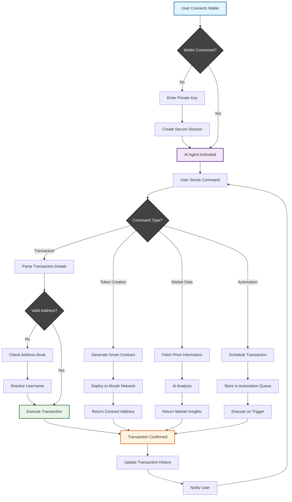

# 🚀 Astra_morph - AI-Powered Blockchain Transaction Agent

> **The Ultimate AI Agent for Seamless Blockchain Transactions on Morph Network** 🌟

Astra_morph is a revolutionary AI-powered agent that transforms how you interact with blockchain transactions. Built specifically for the Morph network, it combines the power of artificial intelligence with blockchain technology to provide an intuitive, secure, and automated transaction experience.

## ✨ Key Features

### 🤖 AI-Powered Transaction Management
- **Smart Chatbot Interface**: Send MORPH, ETH, and other tokens through natural language commands
- **Intelligent Transaction Processing**: AI understands context and executes transactions seamlessly
- **Voice & Text Commands**: Multiple input methods for maximum convenience

### 📚 Unique Address Book System
- **Username-Based Transactions**: Send tokens using memorable usernames instead of complex addresses
- **Contact Management**: Organize and manage your frequent transaction recipients
- **Smart Address Resolution**: Automatic address lookup and verification

### ⚡ Automated Transaction Features
- **Salary Automation**: Set up recurring salary payments in MORPH to employees
- **Event-Based Payments**: Automated birthday, holiday, and special occasion transfers
- **Scheduled Transactions**: Set up recurring payments with custom schedules
- **Bulk Payments**: Upload employee addresses and automate mass distributions

### 📊 Market Intelligence & Trading
- **Real-Time Price Data**: Get current MORPH and other token prices
- **Market Analysis**: AI-powered market trend predictions (up/down movements)
- **Trading Insights**: Advanced trading data and analytics
- **Price Alerts**: Automated notifications for price movements

### 🪙 Token Management & Creation
- **Custom Token Deployment**: Deploy your own tokens with simple prompts
- **Memecoin Generator**: Create memecoins effortlessly with just token name and symbol
- **Token Swapping**: Easy token exchanges through natural language commands
- **Balance Tracking**: Real-time balance monitoring for all your tokens

### 🔗 Blockchain Integration
- **Transaction History**: Complete transaction logs and analytics
- **Block Explorer**: Access current block details and network information
- **Smart Contract Generation**: AI-powered smart contract creation and deployment
- **Multi-Token Support**: Support for various tokens on the Morph network

### 🔐 Security & Wallet Management
- **Secure Wallet Connection**: Direct wallet integration using private keys (completely secure)
- **Session Management**: Persistent and secure user sessions
- **Automated Security**: Advanced security protocols for all transactions
- **Private Key Encryption**: Military-grade encryption for wallet credentials

### 🎨 NFT & Asset Storage
- **Blockchain Asset Storage**: Store NFTs and digital assets securely on Morph
- **Pinata Integration**: Decentralized storage for metadata and assets
- **Asset Management**: Comprehensive asset portfolio tracking
- **Secure Retrieval**: Easy and secure access to all stored assets

### 📰 Information & Analytics
- **Latest News**: Real-time cryptocurrency and blockchain news
- **Market Reports**: Comprehensive market analysis and reports
- **Token Listings**: Complete token directory and information
- **Network Statistics**: Morph network health and performance metrics

## 🏗️ Astra_morph Activity Flow



## 🛠️ Technology Stack

### Frontend
- **Next.js** - Modern React framework for the web interface
- **TypeScript** - Type-safe development
- **Tailwind CSS** - Utility-first CSS framework

### Backend
- **Python FastAPI** - High-performance API framework
- **Google Agent Kit** - AI agent development toolkit
- **MCP Server** - Model Context Protocol server

### Blockchain
- **Solidity** - Smart contract development
- **Morph Network** - Layer 2 blockchain solution
- **Web3.py** - Python blockchain interaction library

### Storage & External Services
- **Pinata** - IPFS storage for NFTs and assets

## 📖 Usage Examples

### Basic Transaction
```
User: "Send 5 MORPH to john_doe"
Agent: ✅ Sent 5 MORPH to john_doe (0x742d35Cc6634C0532925a3b8D404d3aABb8c4532)
Transaction Hash: 0xabc123...
```

### Automated Salary Payment
```
User: "Set up monthly salary of 1000 MORPH to all employees"
Agent: ✅ Automated salary payments configured for 25 employees
Next payment: March 1st, 2024
```

### Token Creation
```
User: "Create a memecoin called DogeMorph with symbol DMORPH"
Agent: ✅ Token deployed successfully!
Contract Address: 0xdef456...
Symbol: DMORPH
Total Supply: 1,000,000,000
```

## 🔐 Security Features

- **🛡️ Military-grade encryption** for private key storage
- **🔒 Secure session management** with automatic timeout
- **🚨 Transaction verification** before execution
- **📊 Audit trails** for all operations
- **🔍 Smart contract security** scanning

## 🤝 Contributing

We welcome contributions! Please see our [Contributing Guidelines](CONTRIBUTING.md) for details.

1. Fork the repository
2. Create your feature branch (`git checkout -b feature/AmazingFeature`)
3. Commit your changes (`git commit -m 'Add some AmazingFeature'`)
4. Push to the branch (`git push origin feature/AmazingFeature`)
5. Open a Pull Request

## 📄 License

This project is licensed under the MIT License - see the [LICENSE](LICENSE) file for details.

## 🆘 Support

- 📧 Email: support@astramorph.io
- 💬 Discord: [Join our community](https://discord.gg/astramorph)
- 📚 Documentation: [docs.astramorph.io](https://docs.astramorph.io)
- 🐛 Issues: [GitHub Issues](https://github.com/yourusername/astra_morph/issues)

## 🗺️ Roadmap
- [ ] **Q2 2024**: Mobile app development
- [ ] **Q3 2024**: Advanced DeFi integrations
- [ ] **Q4 2024**: DAO governance features

## 🏆 Achievements

- 🥇 **First AI agent** with automated transaction scheduling on Morph
- 🚀 **Unique memecoin creation** feature in the ecosystem
- 🔐 **Most secure** wallet integration system
- 📈 **Advanced market analysis** capabilities

---

**Built with ❤️ for the Morph ecosystem** 

*Astra_morph - Where AI meets Blockchain Innovation* 🌟